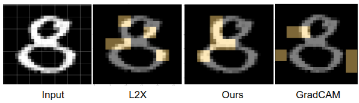
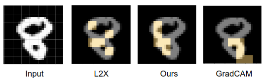
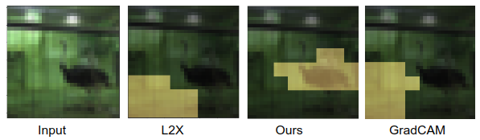
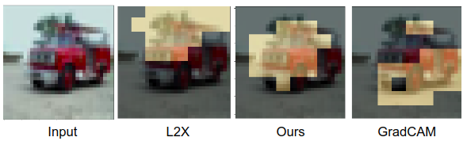

# Instance-wise Causal Feature Selection for Model Interpretation

| Dataset | Sample 1 | Sample 2 |
| ------------- | ------------- | ------------- |
| MNIST| | 
| CIFAR| | 

(Copper color in above images indicates the selected superpixels/patches for explaining the prediction of a black-box model. Note: the black-box model predicted the correct class in all the above images)

### Abstract
We  formulate  a  causal  extension  to  the  recently  intro-duced  paradigm  of  instance-wise  feature  selection  to  ex-plain  black-box  visual  classifiers.  Our  method  selects  asubset of input features that has the greatest causal effecton the model’s output.  We quantify the causal influence ofa subset of features by the Relative Entropy Distance mea-sure.   Under certain assumptions this is equivalent to theconditional mutual information between the selected subsetand the output variable. The resulting causal selections aresparser and cover salient objects in the scene. We show theefficacy of our approach on multiple vision datasets by mea-suring the post-hoc accuracy and Average Causal Effect ofselected features on the model’s output.

- Authors: Pranoy Panda, Sai Srinivas Kancheti, Vineeth N Balasubramanian 
- Affiliation of authors: CSE department, IIT Hyderabad
- Workshop: Causality in Vision, **CVPR 2021**

## Dependencies:
1. Python 3.5+.
2. [PyTorch](https://pytorch.org/)
3. [NumPy](http://www.numpy.org/)
4. [Matplolib](https://matplotlib.org/)
5. [skimage](https://scikit-image.org/docs/dev/api/skimage.html)
6. [captum](https://captum.ai/)
7. [OpenCV](https://opencv.org/)

(you could use pip to install all the dependencies)

Or you may run the following commands in shell to install the required packages:
```shell
git clone https://github.com/pranoy-panda/Causal-Feature-Subset-Selection
cd Causal-Feature-Subset-Selection
sudo pip install -r requirements.txt
```

## Colab notebooks(for hassle free reproduction of results)
1. [MNIST and FMNIST dataset](https://colab.research.google.com/drive/1RFhhCJWxOdTN2BJXqpz9PblJb7RiYuKY?usp=sharing)
2. [CIFAR dataset](https://colab.research.google.com/drive/1r08XtoBzBQUqIYHRRx35OyXMnmYZ9kBw?usp=sharing)


<!--
## Citation
If you use this code for your research, please cite our [paper](https://arxiv.org/):
```
@arxiv{to-be-done,
title = {Instance-wise Causal Feature Selection for Model Interpretation},
author = {Panda, Pranoy and Kancheti, Sai Srinivas and Balasubramanian, Vineeth N}, 
journal={arXiv preprint arXiv:}, 
year = {2021}  
}
```
-->
